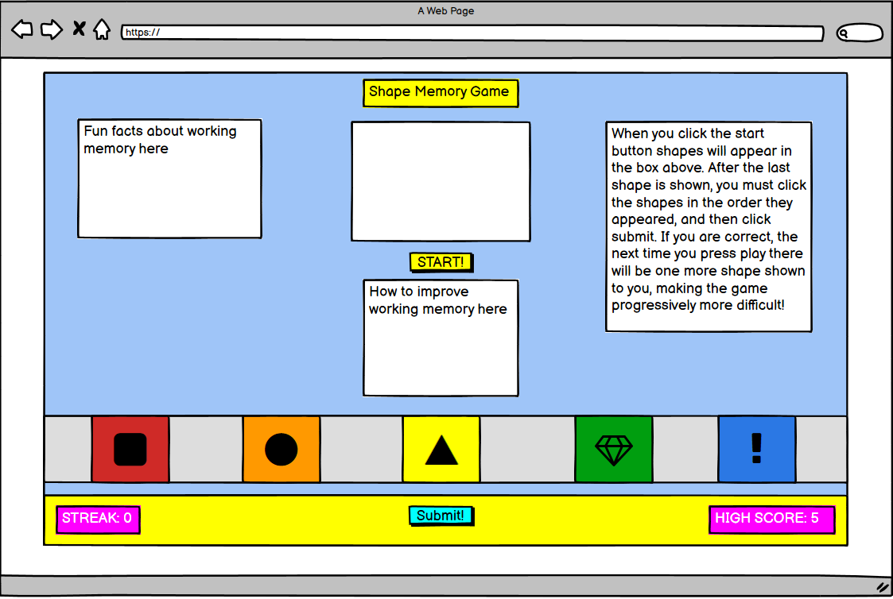

# Shape Memory Game!

## This project is coded as part of my Fullstack Software Development Course in the Code Institute. It is going to be a basic memory game in which the player has to remember shapes displayed to them in the correct order and input them into the computer. It will be written in HTML5, CSS3, and JavaScript.

## User Experience

### The Strategy Plane

The goal of this site is to create a game that the user will enjoy playing. For this to occur the game must be colourful and eye-catching, but it must also be clear and easy to understand. The user must feel a sense of accomplishment when they get answers correct but must also feel challenged as the game progresses. If the game meets these criterea it will be enjoyable for the user and I will have acheived my goal of making a fun game. 

### The Scope Plane

The site will need some key content and functional requirements. In terms of content, the site will need to clearly explain to the user how the game is played. There will also need to be a main game area in the middle of the screen, and the bottom of the screen will contain the cards for the user to select from. With regard to functionality, the site will need to be able to generate an array containing shapes in a specific order and then display these cards to the user one at a time. The game then needs to be able to know when the cards have finished displaying and propmt the user to input their answer. The game needs to then be able to generate an array of shapes which the user inputs and check it against the array generated by the game. If the user is correct the game needs to add one to the correct answer counter and increase the difficulty of the next game. If the user is incorrect the game will return to the easiest level. 

### The Structure Plane

There will be three ways in which the user can interact with this game. They can click the start button to begin the game. An array of shapes will be generated when the user clicks this button. The user will then click on the shapes on the bottom of the screen to input their answer. This will generate an array which will be checked against the computer generated array. Finally, the user will click on the submit button to check their answer. 

### The Skeleton Plane

The design of the game will be quite simple. There will be one landing page on which the entire game is displayed. The top of the page will have the name of the game. To the left will be the instructions of the game. The main box in which the shapes will be displayed will be in the middle of the screen. To the right of this will be some interesting facts about working memory. The bottom of the screen will display 5 cards which have shapes in them. These are how the user is going to input their answer. Under these will be the score counter and the high score counter. The start button and submit button will be under the main box in the middle of the screen. 
A wireframe is provided below

### The Surface Plane 

The site will contain a mixture of very eye-catching colours. The shapes will all be in different colours and this will increase enjoyment of the game. 

## Features

### Interactivity

This site actually has a lot of interactivity. Firstly, when the user clicks the start button, they are shown 3 colorful shapes for a second each with a .5 second gap between each shape. This will hopefully grab their attention right off the bat. Nextly, they are given the chance to input their answer, and when they input their answer they are given the immediate feedback of seeing the small versions of the shapes appearing in the box as they click them. This is another example of the interactivity the site provides the user. When the user clicks the submit answer button, they are shown a different alert depending on the accuracy of their answer. If correct, the game becomes harder the next time they play, making the user feel like they are being included and catered to. If they are incorrect they are shown an alert which asks them if they would like to see the correct answer. While I could have just shown the user the correct answer by default, this seemed to be another good opportunity to include the user input.

### Disable Buttons

This feature is included to prevent the user from breaking the game. The only clickable button on the site when it loads is the start button, then all the buttons are disabled whilst the shapes are being displayed. Finally the user can click on the answer shapes and the submit button at this point. This is a strong feature of the project as it gives the user certainty as to what they are supposed to be doing at any particular time point while they are playing the game. This leads to first-time learning and a more enjoyable experience for the user. Furthermore, it makes it more difficult for somebody to break the game. It also prevents the user from cheating and inputting the answers as they are shown the question. 

### The Display Answer Function

When the user inputs the incorrect answer, they get the option to see their answer compared with the question. I am very proud of this feature as getting it to work properly was quite tricky. It is a strong feature of the game because it adds an extra layer of interaction to the user. They get a visual representation of exactly what shape in the list they got wrong. I like this idea of providing the user with immediate feedback as it generally results in better user experience. 

### Streak and Session Record

The streak counter is on the bottom left of the screen and it counts along in real time as the user gets answer correct. This is another example of interactivity on the site, if the user gets answers correct, they get to see their streak increasing! When the user's streak ends, the game checks if their current streak was higher than their session record. If it was, the user gets alerted that they have achieved a new high score. This high score only remains in the browser as long as the user doesn't reload the page. 

## Features left to Implement

### Saving High Scores

A really cool feature would be the ability to save the high scores of each user and then to hold that data. Then the user could be shown how their high score stacks up against other people who have played the game using percentiles.

## Technologies Used

### HTML5

HTML5 was used to create the base structure of the site. 

### CSS3

CSS3 was used to apply the custom styling to the page. I also created the shapes using CSS3 found on this site (https://coveloping.com/tools/css-shapes-generator)

### JavaScript

Javascript was used to provide the interactivity found on the site. It creates the question lists, handles the showing of the questions, handles the answers given, and then determines if they're correct and responds accordingly. 

### Bootstrap 4 

[Bootstrap](https://getbootstrap.com/) was used to speed up the initial development, as it allowed me to get a working layout very quickly and easily.

### JQuery 3.6

[JQuery](https://jquery.com/) made DOM manipulation more simple and sped up the Javascript portion of the project. It was generally used to make selecting elements from the DOM a much easier process.

## Testing

I conducted numerous tests throughout the building of this project. I relied heavily on console logs and alerts to ensure everything was working as it should be. When playing the game, there are three potential ways the game can go. The user can get the answer correct, they can get the number of shapes incorrect and they can get the number of shapes correct but the values of the shapes incorrect.

### Answer Correct

The user can get the answer correct, in which case they should recieve an alert congratulating them and then the game should increment to show an extra shape the next time the user was correct. To test this I got out a pen and paper and the answer correct 15 times in a row. The game worked properly and it incremented as it was desinged to do. The streak counter moved along correctly. 

### Number of shapes incorrect

Testing this outcome was easy as all I had to do was start the game and either input fewer or more shapes than I was shown. At this point I recieved an alert notifying me of how many shapes I had inputted and how many the correct amount was. This feature is working as it should be. 

### Value of shapes incorrect

If the user gets the number of shapes correct but the value of those shapes wrong then they are asked if they would like to see the correct answer. This is where most of the bugs were found and where most of the developing time was spent. The game was supposed to show the user the correct answer and their answer underneath. However, building in the ability to display more than 10 shapes necessitated the addition of an extra row beneth the answer and question rows. Also, labelling the question and answer proved to be more difficult than initially anticipated. In the end, I decided on a div which would be the same size as the small shapes which would contain a 'q' for question and an 'a' for answer. Another bug encountered at this point was that the layout would break if the red shape was the final shape shown. Initially, I included a shape that resembled a bookmark for this shape. However, it behaved too unpredictably so I had to use a triangle down instead of this shape. Finally, These shapes were aligning slightly off centered when they were being displayed and it was very frustrating. To combat this I added javascript that would justify the content to the left when showing the small question and answer shapes but I set this value back to center when displaying the large question shapes. 

### High Score and Streak Counters

To test if the high score and streak counters were working I had to first get multiple answers correct. The streak counter moves up as the user gets answers correct. To test the high score counter I got the answer wrong. It notified me that I had gotten a new high score and updated the counter in the bottom-right hand corner of the screen. A bug I found at this point was that if the user got the first answer incorrect they were still being notified that they had gotten a new high score of 2. This was because of how the javascript was written to set the new high score. To fix this all I had to do was write an if statement as part of my high score checker function to see if the shapes to display - 1 was greater than 2.  

### Layout Testing

To test the layout I have used the chrome developer tools to view the game at different sizes to see how it looks, I realised the text was small when viewing on larger monitors so I added a media query to make the text larger when viewing on a reasonably high resolution monitor (1920x1080). I also realised that I needed to add some empty space below the shapes as they behave quite strangely and it was the only solution which ensured they weren't cut off by the footer on smaller viewports. 

### ES6 Validation

When pasting my code into an ES6 [validator](https://www.piliapp.com/syntax-check/es6/) the code returned no errors.

## Deployment 

The project was deployed on GitHub pages. 

## Credits

The shapes that were used on the site were generated on a css shape generator tool which can be found at the link above. 

